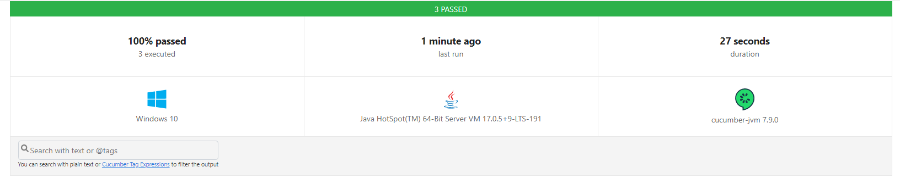
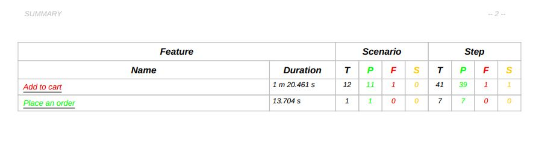
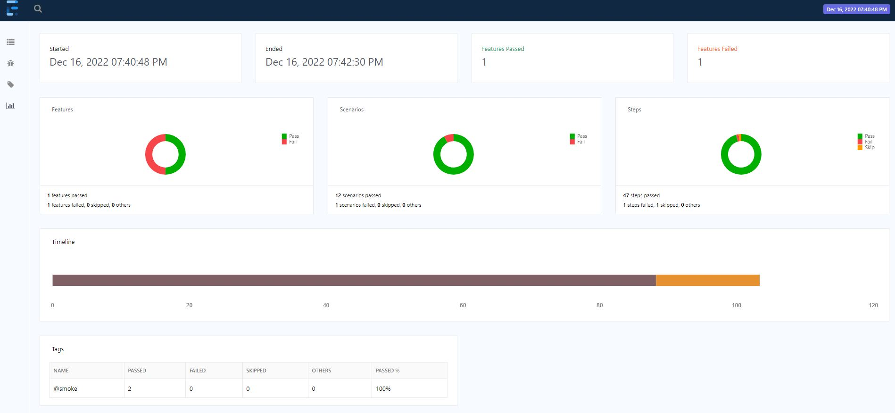

# Cucumber BDD Framework with Selenium and Java


## Technology Stack


---

## Key Learnings from the Course


---

## Installation and Setup

* Install JAVA JDK (version 17 and above) and set **JAVA_HOME** `C:\Program Files\Java\jdk-17.0.5` as system environment variable
* Download and install Maven build tool, and set **MAVEN_HOME** `C:\Program Files\apache-maven-3.8.5` system environment variable
* Add the path of bin folders in System Path variable like _%JAVA_HOME%\bin_ and _%JAVA_HOME%\bin_
* Run the commands in Command Prompt to verify the installation `java -version` and `mvn -version`
* Intellij IDEA and install the Plugins (Cucumber, Gherkin)
* Install the maven dependencies listed in POM.xml (or build the POM.xml in this case so the dependencies can be installed)

---

## Course Notes

### BDD

Here is the list of some activities to look for that can indicate you are following BDD:

* You are having conversations around features, user stories and coming up with clearly defined Acceptance criteria
* You are having Discovery workshops to build shared understanding of the feature to be built.
* Requirements are written as behaviors
* The behaviors and not tests are driving your development.
* You are converting acceptance criteria into executable specifications in some standard format like Gherkin.
* You are automating executable specifications using collaboration tool like Cucumber

---

### Gherkin Syntax

* If you get error while executing the dummy feature, then delete the main.java and org.example package and main or app pre-generated test
  classes.Then right-click on the
  project root directory and build the project. If you change the folder paths or names, then also rebuild the project by right-clicking the project
  root directory. If the error persists, then Click on the Select Run/Debug configurations, and chose Edit Configuration. Change Build to
  Build-Project.
* Gherkin evaluates the steps with regular expressions and ignores the keywords like Given, When , Then so they will point to the same step
  definition.
* Free floating text can be put under Feature, Rule and Scenario to add the description. This text will be ignored by the Cucumber while execution.
* A feature can be represented by one or more user stories.
* Scenario and Background can be put under different rules in single feature. `Rule` can be used to group several scenarios under a business rule in
  single feature.
    * 
    * 
* you can put `asterisk *` to avoid writing multiple And keywords in the beginning of the step.
* But keyword designates the negation.
* **Steps Anti-Patterns**
    * Write the Gherkin in the form of business documents and avoid writing as user interaction steps. Stick to the core flow, and hide the
      implementation in steps definitions.
    * 
* Group the similar scenarios and different parameters with scenario outline instead of writing multiple scenarios separately.
* Examples in scenario Outline can also be tagged to execute under different test environments or conditions.
* In case of a String parameter in Scenario Outline, put the double quotes around the parameter brackets for it to resolve e.g. _"<product_name>"_
* Single Feature file can have only one Background but if it contains Rule, then each Rule can have separate Background.
* Background Tips:
    * Do not complicate
    * Keep it short
    * Expressive and vivid
    * Keep scenarios short
    * Do not add technical steps such as initializing webdriver, clearing databases, fetching API token etc. in the Background as they have no
      interest
      in the business.
    * These steps can be implemented inside cucumber hooks.

---

### Gherkin Anti-patterns

* Well written Gherkin can give benefits such as low maintenance in case of UI changes, high re-usability of compact steps, improved business
  readability and expressive steps, and increased collaboration.
* Do not stretch the scenarios and add user actions related to UI to complicate the scenario.
* A poorly written Gherkin:
  
* This will result in high maintenance if the implementation is changed later, ideally scenario should only be changed if the requirement
  changes.
* It contains many incidental steps that could be removed for example When I click on the View Cart link should be removed because validating
  the product name and quantity will take care of it.
* Doing too many things in the scenario could result in the failing of main intention. For example, validating the tick mark is not necessary.
* Purpose of this scenario is to validate the functionality and not the UI, therefore avoid writing multiple When Then statements.
* Thumb rule of the scenario is to have 5 - 8 steps. Lengthy scenario should be split.
* Conjunction Step should be avoided For example, _Given I am on Homepage, add I navigate to the store page_.... by splitting with And keyword. This
  way the steps can be resued.
* Lack of good scenario name, narratives and rules is bad practice. Here scenario can be named as _Add a product from store_. Use the description text
  to add more detail.
* By following thr Gherkin good practices, the scenario can be refactored to:
* 

> Gherkin serves as a Living documentation which is a single source of truth for all the stakeholders. Writing good Gherkin means a readable and
> understandable Living documentation. The Living documentation should clearly show the current state of the system, what behaviors are working, what
> are pending and what are not working. If we don't use Gherkin to describe the behavior of the system, the whole purpose of writing Gherkin gets
> defeated. Then it just becomes a UI action script written in plain language. Just an unnecessary wrapper on top of the underlying automation layers
> that can result into high maintenance.

---

### Runners

* If the cucumber feature and steps definitions are under the same root folder i.e. `src/test/java`, then Cucumber can automatically find the steps
  for the features.

> Runner must end with keyword "test" because this is how maven will find the test runner.

* But if you move the features to another source root folder i.e. `src/test/resources`, then Cucumber will throw error. In this case, the features and
  steps must be under same package/director name e.g. `cucumberPractice`.
* Runner helps us to define the explicit location of steps and feature files, run multiple scenarios, and tag the scenarios.
* Maven is needed for all the runners to be able to execute features from command line.
* Following Runners exist in Cucumber. Read the [Running Cucumber Docs](https://cucumber.io/docs/cucumber/api/?lang=java#running-cucumber)
    1. **CLI**: io.cucumber.core.cli.Main
        * Maven exec
        * Scenarios in parallel
    2. **jUNIT**: Runner Class

    * supports annotated methods
    * Features in parallel

    3. **TestNG**: Runner class

    * supports annotated methods
    * Scenarios in parallel

#### CLI Runner

* The Command-Line Interface Runner (CLI Runner) is an executable Java class that can be run from the command-line.
* Delete the target folder and run the following commands via terminal:
    * `mvn clean test` this will create the fresh target folder
    * `mvn exec:java -D"exec.classpathScope=test" -D"exec.mainClass=io.cucumber.core.cli.Main"` Since our features and steps definitions are under the
      same package, we do not need to give the argument parameter.

#### jUnit Runner

* Add the cucumber-junit dependency in POM.xml
* If you are using the `<scope>test</scope>`, then make sure that all the cucumber test classes are in src/test path.
* If you want to put the test classes inside the src/main path then change the scope to `<scope>compile</scope>`.
* Maven can only find the runners if the name ends with test, so add test suffix to all of the test runners, and run with `mvn clean test`
  Alternatively run by right-click.
* If the steps, runner and the features are different packages, then the path to feature files and glue code must be provided with **
  @CucumberOptions**.
* @Before and @After hooks get executed before and after each scenario, these hooks also come with Cucumber so use Cucumber hooks instead of jUnit for
  better portability.
* Order of terminal output of annotated hooks is in reverse order i.e. from bottom to up.
* Cucumber Hooks will execute before jUnit or TestNG hooks.

#### TestNG Runner

* [Cucumber TestNG docs](https://github.com/cucumber/cucumber-jvm/tree/main/cucumber-testng)
* Add the cucumber-testng maven dependency. Remember to disable jUnit dependency in POM.xml and comment out the jUnit runner.
* `mvn clean test` can also be used to run the TestNG test runner from cmd.

* Cucumber 7 has introduced @BeforeAll and @AfterAll that works the same as jUnit and TestNG @BeforeClass and @AfterClass to run the code before and
  after each scenario.
* Cucumber Hooks will also work with the CLI Runner.
* Cucumber Main class cannot see jUnit annotations as it is not using jUnit runner for execution. It is using its own internal mechanism.
* The default `thread count of the dataprovider` in parallel mode is 10. To change this the `dataproviderthreadcount` property needs to be added to
  the
  `configuration` section of the Surefire or Failsafe plugin in the POM.

````xml

<configuration>
    <properties>
        <property>
            <name>dataproviderthreadcount</name>
            <value>20</value>
        </property>
    </properties>
</configuration>
````

> The `dataproviderthreadcount` attribute that you have set in your pom file is going to be applicable and relevant only when you are running your
> test
> via mvn clean test. If you are trying to run this test class from within the IDE (IntelliJ or Eclipse for that matter) its not going take affect.
---

### Cucumber Options

The **@CucumberOptions** can be used to provide additional configuration to the runner.
Maven command will always override the cucumberOptions.

#### plugin

* `pretty` plugin will output the scenario steps in colorful format.
* `html:target/cucumber.html` will generate the cucumber test report.
* you can also run TestNG and jUnit tests through command line
  with `mvn clean test -Dcucumber.plugin=pretty -Dcucumber.plugin=html:target/cucumber.html`
* with CLI, you can run first `mvn clean test` and
  then `mvn exec:java -D"exec.classpathScope=test" -D"exec.mainClass=io.cucumber.core.cli.Main" -Dexec.args="--plugin pretty --plugin html:target/cucumber.html"`

#### Snippets

* if you want to tell Cucumber to print code snippets for missing step definitions use the summary plugin.
* @`CucumberOptions(plugin = {"pretty", "summary"}, snippets = CAMELCASE)`
* The default option for snippets is UNDERSCORE. These settings can be used to specify the way code snippets will be created by Cucumber.

#### Performing a dry-run

* if you want to check whether all feature file steps have corresponding step definitions, you can specify it like this:
* `@CucumberOptions(dryRun=true)`
* The default option for dryRun is false

#### Formatting console output

* if you want console output from Cucumber in a readable format, you can specify it like this:
* `@CucumberOptions(monochrome=true)`
* The default option for monochrome is false.

#### Select scenarios using tags:

* if you want to tell Cucumber to only run the scenarios specified with specific tags, you can specify it like this:
* `@CucumberOptions(tags = {"@foo and not @bar"})`
* you can have multiple tags on one scenario.
* `tags = "@smoke and @dummy"`, this will run the scenarios that have both smoke and dummy tag
* `tags = "@smoke or @dummy"`, this will run the scenarios that have either smoke tag or dummy tag or both tags.
* `tags = "@smoke and not @dummy"`, it will only execute the scenario which has smoke tag and that does not have dummy tag

#### Glue and feature files path

* If the steps and features are not under the same package name, then you have to specify the steps path with glue parameter and feature path with
  feature parameter.
* Path of the feature file starts like src/test/resources/cucumberPractice directory.
* Path of the steps definitions starts from package name under src/test/ java like cucumberPractice.stepdef
* path to hooks can also be specified under the glue parameter.

* Cucumber Options can bve overridden using System properties from Maven command line. e.g. `mvn test -Dcucumber.pluggin=pretty`

> Tip: Download source and java docs by right-clicking on the keyword and navigate to Go To -> Declaration or Usages, and then click on Download
> sources on Top right. This will show the cucumber documentation for a specific keyword when you hover on it which will help in understanding the
> implementation logic.

---

### Cucumber Expressions

* [Cucumber Regular Expressions Cheat Sheet](https://agileforall.com/wp-content/uploads/2011/08/Cucumber-Regular-Expressions-Cheat-Sheet.pdf)
* Cucumber will create a Cucumber Expression by default. To use Regular Expressions, add anchors (starting with ^ and ending with $) or forward
  slashes (/)
* Foe the step: **Then I see 1 "<product_name>" in the cart**, here is how the expression can be formulated:
    * `@Then("^I see (.*) \"([^\"]*)\" in the Cart$")` is the example of regular expression
    * `@Then("I see {int} {string} in the Cart")` is the example of cucumber expression
* Cucumber also supports optional text. It's grammatically incorrect to say 1 cucumbers, so we should make the plural s optional. That can be done by
  surrounding the optional text with parentheses: `I have {int} cucumber(s) in my belly`
* Similarly, it supports `Alternative text`, and `Escaping`.
* [Cucumber Expressions Docs](https://github.com/cucumber/cucumber-expressions#readme) read in detail about the cucumber steps.

#### Custom Parameter Types

* Cucumber Expressions can be extended so they automatically convert output parameters to your own types. It can make code readable.
* [GitHub docs](https://github.com/cucumber/cucumber-expressions#readme)
* [Cucumber configuration](https://cucumber.io/docs/cucumber/configuration/?lang=java)
* For example take this step: **When I add a "<product_name>" to the cart**, and its step definition:

```java
  @When("I add a {string} to the cart")
public void i_add_a_to_the_cart(String string){
        // Write code here that turns the phrase above into concrete actions
        }
```

* The problem is I do not understand what exactly is string in my step definition. This can be improved by changing the parameter
  to `String productName`
* If the productName is to be shared among multiple feature files, then a product object i.e. domain object should be created.
    * For this purpose, create a product Object.
  > Tip: To automatically generate a constructor, getter and setter of the class variable, right-click on the variable, and then Generate -> Getters
  and Setter
    * ```java
      public class Product {
      public String getName() {
          return name;
      }

      public void setName(String name) {
          this.name = name;
      }

      public Product(String name) {
          this.name = name;
      }

      public String name;
      }
      ```
* Now we can use this product to improve readability in our step as:

```java
  @When("I add a {string} to the cart")
public void i_add_a_to_the_cart(String name){
        // Write code here that turns the phrase above into concrete actions
        Product product=new Product(name);
        System.out.println("Product Name: "+product);
        }
```

* With Cucumber Customer custom parameter type, we do not even have to instantiate the object and can access it directly

```java
@When("I add a {product} to the cart")
public void i_add_a_to_the_cart(Product product){
        // Write code here that turns the phrase above into concrete actions
        System.out.println("Product Name: "+product.getName());
        }
```

* The cucumber `@ParameterType` annotation will automatically create the product

```java
  @ParameterType(".*")                        // regexp:
public Product product(String name){       // type, name (from method)
        return new Product(name);                   // transformer function
        }
```

* The regular expression can further be restricted to allow specific inputs e.g. to allow _Blue Shoes_ and _Anchor Bracelet_ we can write regexp
  as `"@ParameterType("\"Blue Shoes\"|\"Anchor Bracelet\"")`
* We added Backslash \ to escape the double quotes around the productName in examples.
* Create a separate class to store all of your custom parameter types, and provide path in runner file glue parameter.

> Tip: When steps definitions, hooks and other implementations are put under different packages, then put the path in Runner glue parameter. In this
> case, run the scenario from the runner file.

---

### Data Tables

* Data tables from Gherkin can be accessed by using the DataTable object as the last parameter in a step
  definition. [Read more](https://github.com/cucumber/cucumber-jvm/tree/main/cucumber-java#data-tables)
* Cucumber DataTable supports the following collections:
    * `List<List<String>> table`
    * `List<Map<String, String>> table`
    * `Map<String, String> table`
    * `Map<String, List<String>> table`
    * `Map<String, Map<String, String>> table`
* Cucumber can map step arguments as datatable list if the arguments are provided vertically with single column ny using DataTable `asList()` method.
  This datatable will be converted to List<String>.

```
  Scenario: single row with no header
  Given my credentials
  | john |
  | john123 |
```

* In case of horizontal parameters, use the DataTable `values()` method. use `row(0)` if you want to fetch the first row or `rows(startRow, endRow)`
  for multiple rows
* Use `asLists()` if you want to get `List<List<String>>` table and have multiple rows. It can also work with single row but then the
  code `creds.get(0).get(0)` is not readable.
* Instead of using Datatable datatable, you can directly use the collection in step definition argument also.

```java
@Given("many credentials")
public void manyCredentials(List<List<String>>creds){
        //List<List<String>> creds = dataTable.asLists(); //returns list of list
        System.out.println("ROW 0 USERNAME = "+creds.get(0).get(0));
        System.out.println("ROW 0 PASSWORD = "+creds.get(0).get(1));
        System.out.println("ROW 1 USERNAME = "+creds.get(1).get(0));
        System.out.println("ROW 1 PASSWORD = "+creds.get(1).get(1));
        }
```

* To make code more readable, we can create a transformer function to transform the datatable into domain object.
* In our case, we are pasing username and password to the step so we pass List<String> to the transformer method parameter. It gets values from
  Gherkin step as a List of strings and returns a new object of Customer. Therefore, we can now use Customer domain object directly in our step
  parameter instead of creating the object manually by `Customer customer = new Customer(creds.get(0).get(0), creds.get(0).get(1));`. Change the step
  parameter to use customer domain object instead.
* Cucumber supports the following parameter types for `@DataTableType`
* 
* Here is how the transformer function can transform the step arguments to the customer object.

```java
 @DataTableType
public Customer customerEntry(List<String> entry){
        return new Customer(entry.get(0),entry.get(0));
        }

@Given("my credentials")
public void myCredentials(Customer customer){

        //BAD Practice, use custom domain object instead
        //Customer customer = new Customer(creds.get(0).get(0), creds.get(0).get(1));
        //System.out.println("USERNAME = " + creds.get(0).get(0));
        //System.out.println("PASSWORD = " + creds.get(0).get(1));

        //Use this if you are passing customer domain object as step argument
        //GOOD practice, use domain objects with cucumber dataTable transformer
        System.out.println("USERNAME = "+customer.getUsername());
        System.out.println("PASSWORD = "+customer.getPassword());

        }
```

* If you have Gherkin step with multiple rows datatable then you cannot supply `List<List<String>>` to your transformer function annotated with
  `@DataTableType` because it is not supported as valid type. To solve this you can use `List<Customer> customers` in your step argument and access
  the index.
* This is how you can use the @DataTableType to directly map the data table to our domain object. Depending upon the shape of table, you have to
  implement the logic in transformer method and then return your domain object.
* If the Gherkin step datatable is of **single row with header** then you can use `List<List<String>>` or `List<Map<String, String>>`
* If the Gherkin step datatable is of **multiple rows with header** then you can again use `List<Map<String, String>>` and access the corresponding
  row.
* To further simplify instead of using List or Map collection, you can use use custom domain object as step argument with @DataTableType transformer.
* if the gherkin step datatable is of **single column with no header**, then either you can use collection` List<String>` or you can use Cucumber
  datatable and extract the List of strings with `datatable.asList()`
* If the Gherkin step has datatable of **single column with header**, then you can use DataTable and asMap() method to extract
  to `Map<String, String>` collection.

> You can either use DataTable as step argument and then transform it to collection within step like `List<String> cred = datatable.asList();` or you
> can directly use the collection `List<String> cred` as an argument in step. Only supported collections listed above can be used as step argument in
> step definition method. In case of using datatable we have the advantage of many methods that come with it.

* If the Gherkin step has datatable of **single column with no header DataTableType**, then you can map it to domain object and use `@Transpose`
  annotation in the step definition argument to convert the credentials to list of strings (rows).

> We use `@Transpose` because Cucumber understands the first row as header, so we need to take the transpose of the data table to convert column to
> row.

> You can also use DataTable as argument in transformer method instead of collection and access values with `dataTable.row(0).get(1)` for username
> and `dataTable.row(1).get(1)` for password and hence you do not need to take the transpose in step definition argument later.

* If the Gherkin step has datatable of **single column with header DataTableType**, then you can use the `Map<String, String>` in transformer method
  and return the customer object that can then be used in step definition with the `@Transpose` annotation in front of the argument.
* If the Gherkin step has datatable of **multiple column with header DataTableType**, then you can use the same concept as above but this time the
  argument to the step definition will be `List<Customer>`
* You can play around with the practice code in this repo by running the `data_table.feature` in `cucumberPractice` package and by running your
  desired scenario.

---

### Hooks

* [Official Cucumber Hooks Docs](https://cucumber.io/docs/cucumber/api/?lang=java#hooks)
* `@Before` and `@After` hook will execute for each of the example in scenario outline.
* Import the Hook from `io.cucumber` library and not from the jUnit or TestNG.
* You can pass the `Scenario` class object as argument to the `@Before` and `@After` hooks and can perform different actions on the scenario like
  getting the scenario name, status, tag name, and `attach()` method for creating screenshot etc. The `scenario` parameter is optional. If you use it,
  you can inspect the status of the scenario. For example, you can take a screenshot with WebDriver for failed scenarios and embed them in Cucumber’s
  report.
* `@After` hooks run after the last step of each scenario, even when the step result is `failed`, `undefined`, `pending`, or `skipped`.
* In case of UI Automation, hooks can be used to set up and teardown webdriver and in case of API automation you can put the request specification in
  before hook.
* Hooks should only contain low level technical details and not the business logic.
* You can also specify the order for hooks. Higher order hook will execute first.
* Hooks can be conditionally selected for execution based on the tags of the scenario. To run a particular hook only for certain scenarios, you can
  associate a `Before` or `After` hook with a tag expression.
* Global hooks `BeforeAll` and `Afterall` will run once before any scenario is run or after all scenario have been run.
* Step hooks invoked before and after a step. The hooks have ‘invoke around’ semantics. Meaning that if a `BeforeStep` hook is executed
  the `AfterStep`
  hooks will also be executed regardless of the result of the step. If a step did not pass, the following step and its hooks will be skipped.
* You can play around with the practice code in this repo by running the following test runner in Intellij `cucumberPractice.runners.TestNGRunnerTest`
  .
  Hooks are added in glue path.

---

### Tags

* [Official Cucumber Tag Docs](https://cucumber.io/docs/cucumber/api/?lang=java#tags)
* Tags are primarily used for
    * Running a subset of scenarios
    * Restricting hooks to a subset of scenarios
* A feature or scenario can have as many tags as you like. Separate them with spaces.
* Tags can be placed above the following Gherkin elements: `Feature` `Scenario` `Scenario Outline` `Examples`
* In `Scenario Outline`, you can use tags on different example like below:
* It is not possible to place tags above `Background` or steps (Given, When, Then, And and But).

#### Tag Inheritance

* Tags are inherited by child elements.
* Tags that are placed above a `Feature` will be inherited by `Scenario`, `Scenario Outline`, or `Examples`.
* Tags that are placed above a `Scenario Outline` will be inherited by `Examples`.

#### Running a subset of scenarios

* `mvn test -Dcucumber.filter.tags="@smoke and @fast"`
* Or changing your JUnit 4/TestNG runner class:
  '''java
  @CucumberOptions(tags = "@smoke and @fast")
  public class RunCucumberTest {}
  '''

#### Ignoring a subset of scenarios

'''java
@CucumberOptions(tags = "@smoke and not @fast")
'''

---

### Selenium Webdriver Integration

  

* Selenium WebDriver communicates with the browsers via vendor specific driver executables such as ChromeDriver, Geckodriver etc. The test
  frameworks such as jUnit, TestNG, and Cucumber are responsible for running and executing your WebDriver related steps in your
  tests. [Read more](https://www.selenium.dev/documentation/overview/components/)
* `addToCart.feature` in `cucumberPractice` has been automated as part of first automation scenario
* `guest_place_an_order.feature` in `cucumberPractice` has been automated as part of second automation scenario. Good practices of Gherkin are
  followed in
  second
  feature. There are no UI actions, and we are not adding lines such as user is on home page because this is not related to the scenario instead we
  are abstracting these details in the steps definitions. The billing details are added as part of step arguments but these can also be put in JSON or
  CSV file and extracted directly in the step definition if the details are not important for business logic.
* Run the automation scenarios either directly by hitting the run icon next to the feature or Scenario, or you can create a TestRunner.
* By-default in the run configuration, Intellij also adds `cucumberPractice.hooks` in glue parameter, so if hooks are getting executed, you can remove
  this parameter by editing the configuration.

--- 

### Anti-patterns

#### Feature coupled Step Definitions

* Step definitions should be split into multiple smaller classes based on their domain. Each domain class should contain the steps that are related to
  this domain for example, in this case the Product, Store, Checkout, Payment, and Cart could be the suitable candidates for step definitions classes.
  All
  the steps that are to be performed on this domain should be placed into the respective domain classes.

#### Static Keyword in Step Definitions

* Webdriver should be initialized only once in the step definition class, we can achieve this using `Static` keyword. This also comes with its own
  issues like you cannot run the scenario if the driver is not already initialized by another scenario previously.
* Another issue is parallelism, since we are using the `static`keyword, it means that all the steps are using the same driver instance and that could
  result in conflict i.e. it is also
  going to perform UI action in the same browser. To solve this issue, you can use Java `ThreadLocal` class, that will maintain different copies of
  webdriver for each thread.
  '''java
  private static ThreadLocal<WebDriver> driver = new ThreadLocal<WebDriver>();
  '''
* This also has a problem if there are multiple steps definitions as you have to initialize the driver multiple times, and it nullifies the DRY (Do
  not
  Repeat Yourself) principle. For this, create a reusable method for instantiating driver in a separate class and call it in your step definitions.

#### Duplicate UI Elements definitions

* Use Page Object Model (POM) to define UI elements to avoid duplication, adn write all associate actions for it in page objects.

#### Lack of Waits

* It is advisable to put Explicit wait for the situations so it could wait for time before proceeding to the next set of instructions. Avoid
  using `Thread.sleep()` that will continue to wait even if our desired waiting condition has been met. Generally API calls could take 30 seconds to
  serve response so that can be used as standard.

#### Lack of Domain Objects

* It is advisable to use the Domain Objects which helps to share the state between steps. This improves the readability. BDD is all about domain
  objects, the feature and step definitions should not be too technical, ideally they should only be used to call the methods of automation layer.
  Instead of using Java collections as step arguments, Cucumber provides the `@ParameterType` and `@DataTableType` annotations to work with.
  '''java
  @When("I add a {product} to the cart")
  public void i_add_a_to_the_cart(Product product) {
  }
  '''

#### Dependent Scenarios

* It is advisable not to share the following between different scenarios as one scenario could change the state/value that the other scenario needs,
  so it is better to create separate test user and data so the tests could run in parallel:
    * **Driver instance** (driver instance should not be shared in scenarios which is important for parallel execution)
    * **Application state** (each scenario should start from clean application state, and should not start from state created by previous scenario)
    * **User state** (one scenario might change the user state which the other scenario is not expecting)
    * **Test data** (corruption of test data could result in failing of all the scenarios)

#### Using UI for creating Application State

* We are using UI for creating application state in step where product is to be added in cart (clicking on add to Cart button, and clicking on View
  cart button). UI automation is unreliable and slow and creates maintenance overhead if the elements or work-flow change. Instead, we could use API
  calls and inject cookies in the browser to add product to the cart which is a pre-requisite for the next steps where we are making assertions. We
  could also create a separate customer via API with pre-provided customer billing details, so we do not have to create customer details each time.

#### More Anti-patterns

* base url should be put in the configuration file and the endpoint should be put in JSON file.
* static expected text should be put in the properties file so the same text could be used for multiple assertions.
* Webdrivermanager should be used that manages the browser binaries automatically
* test should support cross browser testing therefore driver setup should provide support for it.
* test suit should be able to receive the browser and base url via maven commands.

---

## Framework


* Multiple components work together to create a `robust` production-ready test automation framework which will be `maintainable`, `readable`,
  and `scalable`.
* Feature files will contain Gherkin in the form of executable specifications.
* Glue code will be in steps definitions. `Hooks` will be used to initialize and close webdriver.
* The webdriver will be supplied by `factory`, and is sent to the Base Page in Page Objects. Base Page will initialize waits and other page factory
  elements. Page objects will be subclasses of base page.
* On Cucumber side, Domain objects for Customer, Product etc. will be created, and `Custom Types` will be used to directly convert Gherkin data to
  `Domain Objects`.
* The reusable REST-assured methods will be used to make API calls for Application and generate cookies.
* Steps will be distributed among multiple step definition classes, and to share the webdriver, Page objects, domain objects, and cookies between test
  steps, we will create Test Context. The `pico-container` dependency injection library will help to share the test context between steps.
* Common Information will be stored in separate `properties` files such as cucumber info will be stored in cucumber.properties, environment info will
  be
  stored in
  environment.properties.
* `Test data` will be stored as JSON, and constants will be stored in separate `CONSTANT` file.
* `Utilities` such as Faker API will be used to create test data, Jackson will help to parse JSON, cookie utility will convert REST-assured cookies to
  selenium cookies, and properties utility will be used to read the config properties file.
* The framework will support the jUnit, TestNG, and Cucumber CLI runner.
* As part of the `CI` process, framework will be integrated to `GitHub` and `Maven` build tool will trigger the tests through `Jenkins` with SCM
  polling,
  build frequency and GitHub webhooks.
* The Cucumber reports and `Serenity` reports will be used for reporting, `screenshot` will be captured on failing scenario and integrated into
  report.

---

### Framework - Driver Initialization

* DriverFactory class will initialize the Webdriver. Static keyword will bind the driver instance to the class, and helps to reuse the driver instance
  in scenario. The static methods `initilizeDriver()` and `getDriver` will not create the new instance of the class which will set the driver to null
  each time new instance of the DriverFactory is made.
* @Before and @After hooks will be used to set up and teardown drivers before and after each scenario.

---

### Framework - Page Object Model

* `BasePage` class will initialize the Selenium Wait and UI elements of the PageFactory. The driver and wait are set as protected so the child page
  classes can use these. `load(url)` method will be used to open the url provided as String.
* The constructor of Page Objects will pass the driver to BasePage which will use this driver instance to initialize waits and UI Elements.
* `StorePage` will contain the UI Elements and methods being performed on store page, like `addToCart()` method with Explicit waits for better
  reliability.
* `CartPage` will contain the UI elements of product Name and Product Quantity as well as the link to the checkout button and getting the text notice.
* `CheckoutPage` will contain all the UI elements related to billing details, and the method to fill form and placing an order.
  The `setBillingDetails` method is suing the **Builder pattern** as each of enter details method will return the object of the same class
  i.e. `CheckoutPage`, so using this object we can call the next method in the class. We are using `return this` at the end of the methods which will
  return the instance of the same class.
* The step definitions file is now fairly clean and readable.

---

### Framework - Domain Objects

* We can provide the billing details as part of `Given` step like `And my billing details are`, and then we can share the state between multiple steps
  by injecting the domain objects using the dependency injection library.
* First we will try to do this with a class instance variables, and then reuse these instance variables in different steps. This approach has many
  problems, like if we use them as static, then we lose the parallelism advantage, also the variables will not be shared between multiple step
  definition classes.To solve this, we use the dependency injection framework that allows us to share the state between multiple steps in different
  step definition classes.
* We will create domain objects for billing details, and product. This is analogs to creating a POJO class. A custom data table type will convert the
  gherkin datatable to Billing details object.
  ```java
  public class CustomDataTableType { 
     @DataTableType
     public BillingDetails billingDetailsEntry(Map<String, String> entry){
        return new BillingDetails(entry.get("firstname"),
                                  entry.get("lastname"),
                                  entry.get("address_line1"),
                                  entry.get("city"),
                                  entry.get("state"),
                                  entry.get("zip"),
                                  entry.get("email")
        );
     }
  }
  ```
  ```java
  @And("my billing details are")
    public void myBillingDetailsAre(BillingDetails billingDetails) {
        this.billingDetails = billingDetails;
        
        //Instead of using instance variables, we now uuse Datatable
        /*Map<String, String> billingDetail = billingDetails.get(0);
        billingFirstName = billingDetail.get("firstname");
        billingLastName =  billingDetail.get("lastname");
        billingAddressOne =  billingDetail.get("address_line1");
        billingCity =  billingDetail.get("city");
        billingStateName =  billingDetail.get("state");
        billingZip =  billingDetail.get("zip");
        billingEmail =  billingDetail.get("email");*/
    }
  
  @When("I provide billing details")
    public void iProvideBillingDetails() {

        CheckoutPage checkoutPage = new CheckoutPage(driver);
        checkoutPage.setBillingDetails(billingDetails);
        /*checkoutPage.setBillingDetails(
                billingFirstName,
                billingLastName,
                billingAddressOne,
                billingCity,
                billingStateName,
                billingZip,
                billingEmail
        );*/
    }
  ```

* Custom data table type will be created to directly convert the datatable from Gherkin to domain object.
* Similarly, a custom Parameter Type for Product will also be created, and instead of `String` as step argument, we use this custom data object
  i.e. `product`. The
  name of the method under `@ParameterType` annotation must be the same as the name in step definition method argument.
  ```java
  public class CustomParameterType {
    @ParameterType(".*")
    public Product product(String name){
        return new Product(name.replace("\"", ""));
    }
  }
  ```

---

### Framework - Optimizations

#### Config Properties

* We will create a global property `config.properties` under src/test/resources for the base Url, and read it using config loader
  utility `PropertyUtils` under the `utils` package.
* Another utility `ConfigLoader`with the private constructor is created which means that the not other class can instantiate this class. Singleton
  design pattern is employed for achieving this. This ensures only instant for this class throughout program execution. we will load the properties in
  constructor of this class. The `getInstance` method will return the new instance of the class if it not already created. The `getBaseUrl` will give
  us the URL from the loaded properties.
* So to retrieve the url. we can simply call `ConfigLoader.getInstance().getBaseUrl() + "/store/"`
* Since the endpoint could be different, and to avoid writing the above statement at multiple places in the step definition, we can modify
  the `load()` method in `BasePage` like this and only pass endPoint as argument:
  ```java
     public void load(String endPoint){
        driver.get(ConfigLoader.getInstance().getBaseUrl() + endPoint);
    }
  ```
* This utilizes the DRY principle, and we optimized our code to use the url from loaded properties via ConfigLoader and only pass the endPoint
  to `load()`
  method instead of complete URL:
   ```java
     @Given("I'm on the Store Page")
     public void i_m_on_the_store_page() {
        driver = DriverFactory.getDriver();
        //new StorePage(driver).load("https://askomdch.com/store/");
        //new StorePage(driver).load(ConfigLoader.getInstance().getBaseUrl() + "/store/");
        new StorePage(driver).load("/store");
        }
  ```

> yaml is good for multiple programming languages. Plus, it represents the data in hierarchical form. So, it looks good for complex set of data and if
> you want to put everything in one file.

> Properties are good for simple key value pairs and maintaining multiple files, each file representing one set of configuration.

#### Constants & Enums

* As `endpoints` are constant, so we can create an `Enum` class for the endpoints and can access from there. or alternatively a class to hold
  constants as static final class variables. [Read more on Enums](https://refreshjava.com/java/enum-in-java)
  ```java
     public enum EndPoint {
        STORE("/store"), ACCOUNT("/account");

        public final String url;

        EndPoint(String url) {
         this.url = url;
        }
    }
  ```
* To access the endpoints, use the `new StorePage(driver).load(EndPoint.STORE.url);` or `new StorePage(driver).load(BaseConstants.STORE);` depending
  on whether you are using Enum or final class variables.

#### Support for Mobile Browsers

* The preferred way to add a multi browser support is to enable the code to accept the browser as maven command arguments during runtime. We can also
  send this maven command from jenkins.
* For this purpose, we can pass the browser options as a string parameter in the `initializeDriver(String browser)` method of the `DriverFactory`.
* We need to pass the browser as system property in before hook `System.getProperty("browser", "chrome")` with chrome as the default value.
* Run the tests witH `BaseTestNGTestRunner` or through the command line with `mvn clean test`. By-default it runs tests in chrome.
* To run with firefox, use command `mvn clean test -Dbrowser=firefox`, and to run with chrome use command, `mvn clean test -Dbrowser=chrome`
* Firefox browser has known issue of not being able to scroll down to the select dropdown option if it is not in view so to get around we used
  Javascript executor to first click on the dropdown element and then scroll down to the option and click it.
* Another issue that occurred in Firefox tests execution because of the overlay, the place order button could not be clicked, so a method is added in
  BasePage that waits of the overlay to disappear before proceeding to click on the element.

#### Support for Multiple Environments

* Separate properties file with different baseUrl for production and staging environments are created.
* ConfigLoader will accept the environment variable as system property, and load the corresponding property file. It will take by default the staging
  environment if no value is provided for environment through maven command.
* Use the commands `mvn clean test -Denv=PROD` and `mvn clean test -Denv=STAGE` to run the tests in production and staging environment respectively.
* At the moment, the PROD environment url is a dummy one so the tests will fail.

---

### Framework - Parallel Execution

[Cucumber Parallel Execution](https://cucumber.io/docs/guides/parallel-execution/?lang=java)

* For each scenario, Cucumber creates a new instance of Step definitions and hooks class so for each copy it wil get the separate copy of instance
  variables of this class, in our case it will be driver and billingDetails. So we can still run the scenarios without having to use ThreadLocal as
  long as we are not using the static keyword.
* The problem with parallel occurs in DriverFactory class where driver is declared as static variable `private static WebDriver driver;`. In case of
  parallel execution, the statement `driver = DriverFactory.initializeDriver(System.getProperty("browser", "chrome"));` in BeforeHook for the second
  scenario will initialize a new driver, and the previous driver for first scenario will get overwritten which was declared as static in
  DriverFactory. Hence, the first scenario loses the driver object and browser instance becomes stale.
* We need to add `ThreadLocal` class in DriverFactory so each thread gets its own copy of the driver, so whatever scenarios are getting executed by
  that thread they will get their own copy of the driver object.

````java
    public class DriverFactory {
    private static final ThreadLocal<WebDriver> driver = new ThreadLocal<>();

    public static WebDriver initializeDriver(String browser) {
        WebDriver driver;
        driver = new ChromeDriver();
        driver.manage().window().maximize();
        DriverFactory.driver.set(driver);  //Sets the current thread's copy of this thread-local variable to the specified value
        return driver;
    }

    public static WebDriver getDriver() {
        return driver.get();           //Returns the value in the current thread's copy of this thread-local variable.
    }
}
````

#### Using JUnit Runner

* Cucumber can be executed in parallel using **JUnit and Maven test execution plugins**. In JUnit the **feature files are run in parallel rather than
  scenarios**, which means **all the scenarios in a feature file will be executed by the same thread**.
* Add the **Surefire plugin configuration** to the `build` section to the `POM`.
  ```xml
  <build>
      <plugin>
            <groupId>org.apache.maven.plugins</groupId>
            <artifactId>maven-surefire-plugin</artifactId>
            <version>3.0.0-M7</version>
            <configuration>
              <parallel>methods</parallel>
              <threadCount>3</threadCount>
            </configuration>
          </plugin>
  </build>
  ```
* Execute the tests with `mvn clean test`. It should open two browser instances to run both features in parallel, and after one scenario is finished
  it will open the another browser window to execute the second example in Scenario Outline.

#### Using TestNG Runner

* Comment the JUNit Runner and POM dependency when you execute the TestNG runner. This is important to avoid conflicts.
* Cucumber can be executed in parallel using T**estNG and Maven test execution plugins** by setting the **dataprovider parallel option to true**. In
  TestNG
  the **scenarios and rows in a scenario outline are executed in multiple threads**.
  ````java
  import org.testng.annotations.DataProvider;
  import io.cucumber.testng.AbstractTestNGCucumberTests;
  
  public class RunCucumberTest extends AbstractTestNGCucumberTests{
  
      @Override
      @DataProvider(parallel = true)
      public Object[][] scenarios() {
          return super.scenarios();
      }
  }
  ````
* Add the **Maven Surefire plugin configuration** to the build section of the `POM`.
* Execute the tests with `mvn clean test`. It should open the three browser instances and run them in parallel.

* 

#### Using CLI Runner

* Below command will execute the scenarios sequentially via CLI Runner, specify the package of your step definitions in glue parameter and the feature
  files or folder in exec.args:
* `mvn exec:java -D"exec.classpathScope=test" -D"exec.mainClass=io.cucumber.core.cli.Main" -D"exec.args=src/test/resources/framework/features --glue framework"`
* To execute the scenarios in parallel, specify the number of threads in `exec.args` argument in command line:
* `mvn exec:java -D"exec.classpathScope=test" -D"exec.mainClass=io.cucumber.core.cli.Main" -D"exec.args=src/test/resources/framework/features --glue framework --threads 3"`
* Please note that for CLI Runner, maven surefire plugin is not required.

---

### Framework - Dependency Injection using Pico-container

#### Concept

* Keeping all step definitions in a single class quickly becomes impractical, so you use many classes. Cucumber supports several Dependency
  Injection (DI) containers - it simply tells a DI container to instantiate your step definition classes and wire them up
  correctly. [Read More] (https://cucumber.io/blog/bdd/polymorphic-step-definitions/)
* Cucumber scans your classes with step definitions in them, passes them to PicoContainer, then asks it to create new instances for every scenario.
  Before PicoContainer can instantiate these classes it will create an instance of AutomationApi, and then pass the same instance to both
  constructors. Simple!

````java
public class SomeStepDefs {
    public SomeStepDefs(AutomationApi api) {
    }
}

public class SomeOtherStepDefs {
    public SomeOtherStepDefs(AutomationApi api) {
    }
}
````

* [Sharing state between steps in Cucumber-JVM using PicoContainer](http://www.thinkcode.se/blog/2017/04/01/sharing-state-between-steps-in-cucumberjvm-using-picocontainer)
* [GitHub Code](https://github.com/cucumber/cucumber-jvm/tree/main/cucumber-picocontainer)
* With the DI, we can avoid writing the `static` and `ThreadLocal`.

#### Example

* Add the `pico-container` dependency from `io.cucumber` in your POM.
* Create a new package `context` and new class `TestContext` inside it which holds an instance variable `scenarioName`

````java
public class TestContext {
    public String scenarioName
}
````

* If we want Pico-container to create the instance of `TestContext`, we can create a constructor of the Hooks class and pass TestContext as an
  argument. Pico-container will scan the step definitions and hooks classes, and look for the constructor and then creates an instance of the
  TestContext.
* The scenarioName in the TestContext will be different for each Scenario because for each scenario, the new instance of TestContext will be generated
  by Pico-container.

````java
public class BaseHooks {
    private WebDriver driver;
    private final TestContext context;

    public BaseHooks(TestContext testContext) {
        this.context = testContext;
    }

    @Before
    public void setup(Scenario scenario) {
        context.scenarioName = scenario.getName();
        System.out.println("DI Scenario Name: " + context.scenarioName);
    }
}
````

* If you want to use the `context.scenarioName` in a different class, for example, in a step definitions class, we need to create a constructor of the
  class and add TestContext as an argument to that. With this, Pico-container will not create another instance of the TestContext class, it will
  inject the already created instance of TestContext class to the steps definitions when an instance of steps definitions is created.

> Please note that we did not re-assigned the testContext in the constructor of step definition `this.context = testContext;` since we already did
> that in Hooks

````java
public class BaseStepDefinitions {

    public BaseStepDefinitions(TestContext context) {
        System.out.println("Step Definitions DI: Scenario Name" + context.scenarioName);
    }
}
````

* If it prints the scenarioName, then the Pico-container is working well. In the output below, you can see that the scenarioName is getting printed in
  steps definitions for each of the scenario. This is how the pico-container injects the object of TestContext in another class, so we can inject the
  TestContext in any class where we want to use that. **The only requirement is class should have an empty constructor.**

 

#### Inject WebDriver

* We can get rid of the `ThreadLocal Webdriver` variable, and `getDriver()` method in PageFactory.
* Declare a Webdriver driver variable in the TestContext, and assign it in BeforeHook `context.driver = driver;`
* In the steps definitions method, we can remove the `driver = DriverFactory.getDriver();` and use the context driver initialized in hooks as below:

````java
public class BaseStepDefinitions {
    private final WebDriver driver;

    public BaseStepDefinitions(TestContext context) {
        driver = context.driver;
    }
}
````

* Pico-container will make sure that this driver is specific to the scenario, so there will be no conflict when scenarios get executed in parallel.

#### Split Step Definitions using Domain Concept

* Since we now have the DI setup with Pico-container, we can split the step definition classes. The billingDetails need to be shared among multiple
  classes, so we will inject it through TestContext DI.
* Create a new `public BillingDetails billingDetails;` in `TestContext`:
* As we are setting the billingDetails from Gherkin in **CustomerStepDefinitions**, so we need to create an instance variable for TestContext and
  assign it in the constructor.

````java
public class CustomerStepDefinitions {
    private final WebDriver driver;
    private final TestContext context;

    public CustomerStepDefinitions(TestContext context) {
        this.context = context;
        driver = context.driver;
    }

    @And("my billing details are")
    public void myBillingDetailsAre(BillingDetails billingDetails) {
        context.billingDetails = billingDetails;
    }
}
````

* Updating the step definitions classes will now be very easy because we know which class to change if some step changes. Each step definition class
  is focusing on specific domain, so we are following the Single Responsibility Principle (SRP). This will reduce the maintenance effort.

---

### Framework - Optimizations

#### Automated Driver Management

* Use **WebDriverManager** dependency from `io.github.bonigarcia` that will automatically manage the webdriver binaries if browser updates.
* Alternatively, if you are using **Selenium version 4.6.0** or higher, then you do not even need this external dependency as **Selenium Manager**
  takes care of it.

#### Page Factory Manager

* In our step definition classes, we are using the `new` keyword multiple times that creates the new instance of page to perform any actions for
  example `new CartPage(driver).checkout();`.
* It is better to create just one instance of the Page in the beginning and maintain it throughout the program execution. Having one instance of the
  page objects is fine in this case because we are not manipulating the page variables and methods, rather we are only using it.
* To achieve this, we will create the class `PageFactoryManager` and initialize the page objects as static because we need to reuse and maintain them
  throughout program execution.

````java
public class PageFactoryManager {
    private static StorePage storePage;
    private static CartPage cartPage;
    private static CheckoutPage checkoutPage;

    public static StorePage getStorePage(WebDriver driver) {
        return storePage == null ? new StorePage(driver) : storePage;
    }

    public static CartPage getCartPage(WebDriver driver) {
        return cartPage == null ? new CartPage(driver) : cartPage;
    }

    public static CheckoutPage getCheckoutPage(WebDriver driver) {
        return checkoutPage == null ? new CheckoutPage(driver) : checkoutPage;
    }
}
````

* Now in the step definitions, we can directly call the static methods of `PageFactoryManager` to create the new instance or return already created
  instance of the page objects. We can also get rid of the driver since we are not using it in step definition class.

````java
public class CartStepDefinitions {
    private final CartPage cartPage;

    public CartStepDefinitions(TestContext context) {
        cartPage = PageFactoryManager.getCartPage(context.driver);
    }

    @And("I am on the checkout page")
    public void iAmOnTheCheckoutPage() {
        cartPage.checkout();
    }
}
````

---

### Framework - API Integration using RestAssured

* We are creating the application state through UI by adding product to the cart, and navigating to the view cart Link by button click. **Selenium
  should not be used to prepare a test case**. All repetitive actions and preparations for a test case, should be done through other methods.
* [Generating application state](https://www.selenium.dev/documentation/test_practices/encouraged/generating_application_state/)
* We use [Rest Assured](https://rest-assured.io/) to generate the application state. Add the rest
  assured [Maven dependency](https://mvnrepository.com/artifact/io.rest-assured/rest-assured) to your `POM`
* `CookieUtils` class will be used to convert the rest assured cookies to the Selenium cookies.
* Now we need to create a domain object of `Cookies` that will contain the getter and setter for rest-assured cookies and a method to inject the
  selenium cookies to browser. This method utilizes the `CookieUtils` and get the list of selenium cookies and then iterate over them and add them to
  the browser with `driver.manage().addCookie(cookie);` command.
* The `SpecBuilder` class under the package `apis` will hold the `RequestSpecification` and `ResponseSpecification`. Basically the common things that
  we send as
  part of the API Request. In this case we are setting the Base Url (read from configLoader), logging and building it. Similarity for
  the `ResponseSpecification`, we are
  logging the response, building it and returning the object. These methods will be used by get and post methods in `APIRequest` class to make API
  calls.
* The `ApiReuqest` under the package `apis` class will hold the reusable GET and POST methods. These methods are in the form of Given, When and Then.
* The `CartApi` under the package `apis` will set the cookies in its constructor and have the separate `getCookies()` method to fetch the cookies. It
  also has `addToCart(int productId, int quantity)` method to add product to the cart using API call from `ApiRequest` class `post` method. This
  method makes a call to the Endpoint `ADD_TO_CART("/?wc-ajax=add_to_cart")` defined in `constants.EndPoint`. In response, we are fetching all the
  cookies and setting it to the rest-assured `Cookies` object.
* In the `TestContext`, define the `Cookies` domain object as class variable, and in the constructor of TestContext, and initialize the cookies object
  and assign the `empty rest-assured Cookies` to our domain object Cookies because our scenario requires the empty cookies to be sent as part of API
  request.

````java
import framework.domainObjects.BillingDetails;
import framework.domainObjects.Cookies;
import org.openqa.selenium.WebDriver;

public class TestContext {

    public Cookies cookies;

    public TestContext() {
        cookies = new Cookies();
        cookies.setCookies(new io.restassured.http.Cookies());
    }
}
````

* Now in our step definition, instead of adding product to the cart via UI, we will make an API call.

````java
@And("I have a product in the cart")
public void iHaveAProductInTheCart(){
        //storePage.addToCart("Blue Shoes");
        CartApi cartApi=new CartApi(context.cookies.getCookies());        //Initialize the CartAPI with empty rest assured cookies
        cartApi.addToCart(1215,1);                           //make post API and save the response and set the received rest-assured cookies to cookies class variable in CartAPI 
        context.cookies.setCookies(cartApi.getCookies());   //Fetch the cookies from CartAPI and set the TestContext Cookies domain object with it
        context.cookies.injectCookiesToBrowser(context.driver);     //injects selenium cookies to the browser. It calls the method from CookieUtils class to convert rest-assured cookies to the selenium cookies
        }
````

* Also, we need to now directly navigate to the checkout page, because the product has been added to the cart already.

````java
@And("I am on the checkout page")
public void iAmOnTheCheckoutPage(){
        //cartPage.checkout();
        checkoutPage.load(EndPoint.CHECKOUT.url);
        }
````

---

### Framework - Reports

#### HTML Reports

* The Cucumber Report can be generated by adding the `plugin = {"html:target/cucumber/cucumber.html"}` to the `@CucumberOptions` in JUnit or TestNG
  Runner.
* It will generate a cucumber.html report inside target/cucumber folder

  
  

#### Cucumber Cloud Reports

* You can Share your Cucumber Report with your team at https://reports.cucumber.io as indicated in terminal output

  

* If you specify the above properties in `cucumber.properties`, then you will get the following terminal output:

  

* You can also keep the reports forever if you login on Cucumber Reports with GitHub on the cloud report, and create a collection. This will give you
  a
  token`CUCUMBER_PUBLISH_TOKEN` that you can define as environment variable before running cucumber.

---

#### Extent Spark HTML and PDF Reports

##### Resources

* [GitHub grasshopper7 extentreports-cucumber7-adapter](https://github.com/grasshopper7/extentreports-cucumber7-adapter)
* [Cucumber-JVM 7 Report generation using ExtentReports Adapter plugin](https://ghchirp.online/3196/)
* [extent.properties](https://github.com/grasshopper7/cuke7-extent-adapter-report/blob/master/cuke7-extent-adapter-report/src/test/resources/extent.properties)
* [Extent Report 4](https://www.extentreports.com/docs/versions/4/java/cucumber4.html)
* [Cucumber4 Adapter for Extent Framework](https://github.com/extent-framework/extentreports-cucumber4-adapter)
* [Capture Screenshots on Failure](https://www.browserstack.com/guide/take-screenshot-for-failed-test-cases-in-cucumber)
* [Cucumber PDF Report](http://ghchirp.online/2224/)
* [GitHuBGenerating Extent reports for Cucumber-JVM version 7 using the extentreports-cucumber7-adapter plugin] (https://github.com/grasshopper7/cuke7-extent-adapter-report)

##### POM Dependency

* Add the following maven dependencies to your POM.xml
    * To add the Extent report library, add the following dependency
      script.[Extent Reports](https://mvnrepository.com/artifact/com.aventstack/extentreports/5.0.9)
  ````xml
  <!-- https://mvnrepository.com/artifact/com.aventstack/extentreports -->
  <dependency>
      <groupId>com.aventstack</groupId>
      <artifactId>extentreports</artifactId>
      <version>5.0.9</version>
  </dependency>
  ````
    * The latest version
      of [ExtentReports Cucumber7 Adapter](https://mvnrepository.com/artifact/tech.grasshopper/extentreports-cucumber7-adapter/1.9.2) dependency needs
      to be added to the POM, to work with ExtentReports version 5.
  ````xml
  <dependency>
     <groupId>tech.grasshopper</groupId>
     <artifactId>extentreports-cucumber7-adapter</artifactId>
     <version>1.9.2</version>
     <scope>test</scope>
  </dependency>
  ````

##### Plugin Configuration

* The extentreports-cucumber7-adapter plugin needs to be added to the CucumberOptions annotation of the runner.

````java
@CucumberOptions(plugin = {"com.aventstack.extentreports.cucumber.adapter.ExtentCucumberAdapter:"})
````

##### Report Activation

* First method of activating the report generation is to place `extent.properties` file in the `src/test/resources` folder

````properties
basefolder.name=test-output/ExtentReport
basefolder.datetimepattern=d-MMM-YY HH-mm-ss
extent.reporter.spark.start=true
extent.reporter.spark.out=SparkReport/Spark.html
````

* The test report will be generated in a subfolder `SparkReport/Spark.html` inside the parent folder`test-output/ExtentReport d-MMM-YY HH-mm-ss`. The
  **datetimepattern** property ensures that for each run, a new folder is created for the ExtentReport so the old report does not get replaced.
  The `basefolder`optional and creates the report in base folder name with date time
  format. [Read complete properties](https://github.com/grasshopper7/cuke7-extent-adapter-report/blob/master/cuke7-extent-adapter-report/src/test/resources/extent.properties)

##### Report Attachments

* To add attachments, like screen images, two settings need to be added to the extent.properties. First property, named `screenshot.dir`, is the
  directory where the attachments are stored. Second is `screenshot.rel.path`, which is the relative path from the report file to the screenshot
  directory. The screenshot gets available inside the folder where you have directed it in the extent.properties file.

````properties
extent.reporter.spark.out=SparkReport/Spark.html
screenshot.dir=SparkReport/screenshots
screenshot.rel.path=./screenshots/
````

* Attach a screenshot to the failed scenario by adding a new `@AfterStep` Hook, later Extent report will read the screenshot attached to scenario to
  display it in report.

````java
    @AfterStep
public void AddScreenshot(Scenario scenario)throws IOException
        {
        if(scenario.isFailed())
        {
        //screenshot
        File sourcePath=((TakesScreenshot)context.driver).getScreenshotAs(OutputType.FILE);
        byte[]fileContent=FileUtils.readFileToByteArray(sourcePath);
        scenario.attach(fileContent,"image/png","image");
        }
        }
````

* To attach the screenshot to scenario, it needs to be converted into Byte format for which we can use FileUtils utility
  from [comms-io](https://mvnrepository.com/artifact/commons-io/commons-io/2.11.0) maven plugin.
* Since so far, we do not have any failing scenario, so let's add a new scenario in the `add_to_cart.feature` that fails and screenshot gets captured
  and attached to report.

````gherkin
Scenario: Add product from Store that does not exist

This scenario fails because it was written to capture the screenshot on failure and attach to Extent Report.
It fails in the second step because the Invalid Product does not exist on the store page, so the scenario fails to add it to cart

Given I'm on the Store Page
When I add a "Invalid Product" to the cart
Then I should see 1 "Invalid Product" in the cart
````

* Now run the TestNG runner, and the extent report will get generated in `test-output/ExtentReport d-MMM-YY HH-mm-ss/SparkReport/Spark.html` and the
  screenshots will be stored in test-output/ExtentReport d-MMM-YY HH-mm-ss/SparkReport/screenshots` folder and also attached to failed scenario in
  report.


> if you get Fatal error compiling: `java.lang.IllegalAccessError: class lombok.javac.apt.LombokProcessor`, then add the lombok maven dependency in
> your POM

* To change settings like theme, title, encoding, offlineMode etc, a separate xml file
  eg. [html-config.xml](https://github.com/grasshopper7/cuke5-extent-adapter-report/blob/master/cuke5-extent-adapter-report/src/test/resources/spark-config.xml)
  is required. The location for this file eg.
  html report needs to be mentioned as value for the key `extent.reporter.html.config`.

````properties
extent.reporter.html.config=src/test/resources/html-config.xml
````

* It is now possible to add environment or system info properties in the extent.properties or pass them in the maven command line. These key value
  pairs are displayed in the ‘Environment’ section of the dashboard page. The key string should begin with the prefix – `systeminfo.`. Be careful of
  the dot at the end. These can be added to the extent.properties as following – `systeminfo.os=windows`.

##### Extent PDF Report

* [Cucumber PDF Report] (https://ghchirp.online/2224/)
* We will be using Cucumber-JVM 7 Report generation using ExtentReports Adapter plugin.
* The report contains of six sections – dashboard, summary, tags, features, scenarios and detailed sections.
* Now that you have already completed the Extent Spark reporter plugin integration with Cucumber, you can enable the generation of PDF reports by
  adding following two lines in your extent.properties

````properties
extent.reporter.pdf.start=true
extent.reporter.pdf.out=PdfReport/ExtentPdf.pdf
````

* The Cucumber JSON report is required for PDF to be generated, so add the `"json:target/cucumber/cucumber.json"` as `plugin` in `@CucumberOptions`
  annotation in your Test Runner.
* The report settings can be used to toggle on and off optional report sections, change report title, text color for various data, background color
  and other options. The settings are stored in a YAML file with the name `pdf-config.yaml`, located in the src/test/resources folder of the project.
  If the file is not present or any settings are not set, the default values are used. To change the default values, add
  a [pdf-config.yaml file](https://github.com/grasshopper7/cuke7-extent-adapter-report/blob/master/cuke7-extent-adapter-report/src/test/resources/pdf-config1.yaml)
  in the `src/test/resources` folder of the project with only the settings with new values.

* 
* 
* 

> Do not use this report if the setup contains multiple runners as concurrent modification of the same PDF will result in errors. Better solution
> would be use a Maven plugin for [creating just the PDF report](https://ghchirp.online/2224/) or the complete ExtentReport suite(https://ghchirp.online/2114/).

### Framework - Rerun Failed Scenarios

* Dealing with Test Flakiness is often challenging and the test framework should be robust to it. Cucumber provides a rerun
  plugin option in the Runner class that generates a file which contains the information about the failed tests.
* Add `rerun:target/failed_scenarios.txt` in the plugin. The runner file will look like this:

````java

@CucumberOptions(
        features = "src/test/resources/framework/features",
        glue = {"framework"},
        plugin = {
                "html:target/cucumber/cucumber.html",
                "com.aventstack.extentreports.cucumber.adapter.ExtentCucumberAdapter:",
                "rerun:target/failed_scenarios.txt"
        }
)
public class BaseTestNGRunnerTest extends AbstractTestNGCucumberTests {
}
````

* In case of execution failure, it will generate a text file in the target folder. This text file will contain the information on the scenarios that
  get failed.
* `failed_scenarios.txt` will contain the path of the feature file and line number for the scenarios that failed. Here it tells us the path to failing
  scenario and the line number next to it.

````text
file:src/test/resources/framework/features/add_to_cart.feature:13
````

* The next step is to run failed scenarios present in the text file. For this purpose, we have to create a seprate test runner and give the path to
  failed_scenario.txt in features option like `features = "@target/failed_scenarios.txt"`

````java

@CucumberOptions(
        features = "@target/failed_scenarios.txt",
        glue = {"framework"},
        plugin = {
                "html:target/cucumber/cucumber.html",
                "com.aventstack.extentreports.cucumber.adapter.ExtentCucumberAdapter:",
                "rerun:target/failed_scenarios.txt"
        }
)
public class FailedRunnerTest extends AbstractTestNGCucumberTests {

}
````

* Now we can simply run the FailedRun class after automation suite execution in case of test failures. It will execute only the failed scenarios and
  update the text file again.

---

### Framework - Cross Browser Parallel Testing

* We will use TestNG suite XML files. This allows flexible configuration of the tests to be run. These files are created in the normal way, and then
  added to the Surefire Plugin configuration.
* Create a folder in your root directory test-suites and inside the folder create a file smoke-tests.xml. We will create a file based on testng.xml
  and add our tests to it. Since we want to execute our tests parallelly in both browsers, we will create two tests and add a browser parameter to
  each of the test. The test suite will have attribute parallel set to tests, which means that both the tests will run in parallel. The class tag
  should contain your Test runner in the form of package.class. My test runner is under the packages framework and runners and is named
  BaseTestNGRunnerTest therefore I have written it like this `framework.runners.BaseTestNGRunnerTest`

````xml
<?xml version="1.0" encoding="UTF-8"?>
<!DOCTYPE suite SYSTEM "https://testng.org/testng-1.0.dtd">
<suite name="Smoke Test Suite" thread-count="10" parallel="tests">
    <test name="Chrome Browser Test">
        <parameter name="browser" value="chrome"/>
        <classes>
            <class name="framework.runners.BaseTestNGRunnerTest"/>
        </classes>
    </test> <!-- Test -->

    <test name="Firefox Browser Test">
        <parameter name="browser" value="firefox"/>
        <classes>
            <class name="framework.runners.BaseTestNGRunnerTest"/>
        </classes>
    </test> <!-- Test -->
</suite> <!-- Suite -->
````

* The next step you have to do is to create a maven build profile in your POM.xml, copy and paste the following code into your POM.xml. The
  tag <suiteXmlFiles> should contain the path to your TestNG suit XML file. Read more about using Maven build profiles here:

````xml

<profiles>
    <profile>
        <id>Smoke</id>   <!--To tun this profile through command line, mvn test -PSmoke-->
        <build>
            <pluginManagement>
                <plugins>
                    <plugin>
                        <groupId>org.apache.maven.plugins</groupId>
                        <artifactId>maven-surefire-plugin</artifactId>
                        <version>3.0.0-M7</version>
                        <configuration>
                            <suiteXmlFiles>
                                <suiteXmlFile>test-suites/smoke-tests.xml</suiteXmlFile>
                            </suiteXmlFiles>
                        </configuration>
                    </plugin>

                </plugins>
            </pluginManagement>
        </build>
    </profile>
</profiles>
````

* Now you can run this profile simply with the following command. Give the id of thr profile after -P, this will run the tests specified in your suite
  xml file with `mvn clean test -PSmoke`.
* The first part of the equation is already done. Now you have to pass the TestNG suite XML file browser parameter to the tests and initialize the
  WebDriver based on it. Previously we were receiving the browser parameter through maven command line or jenkins, and if no browser is set as system
  variable then we were setting it as chrome in our Hooks.
* Fortunately TestNG gives us a way to access the parameters from suite XML files. We will read this parameter and if it is set we will set it as
  context browser variable, else we will use the browser parameter from system variable. Finally we will pass this browser context variable to
  initializeDriver() method.

````java
@Before
public void setup(Scenario scenario){

        //Reads the browser parameter from TestNG suite xml file
        String browserParam=Reporter.getCurrentTestResult().getTestContext().getCurrentXmlTest().getParameter("browser");

        //Initializes the browser driver in order of following preferences
        //First it looks for the browserParam which is coming from TestNG suite xml files
        //Then it looks for the system variables from the maven command line or Jenkins
        //Lastly it sets the chrome as default browser for driver initialization

        context.browser=browserParam!=null?browserParam:System.getProperty("browser","chrome");

        driver=DriverFactory.initializeDriver(context.browser);
        context.driver=driver;
        }
````

> Default Cucumber report will not work with this configuration and will only show the results of last test runner.

* Use Extent Spark Reports for viewing the test results. There is no additional configuration settings required for parallel execution with a single
  or multiple runners. This is also true for single threaded multiple runner execution. The complete test report can be viewed in console or Extent
  Spark report.
* Read More:
    * https://ghchirp.online/3196/
    * https://ghchirp.online/466/

> PDF report generation is not supported for multiple runners due to concurrent modification of the pdf file. This is mentioned in the
> article https://ghchirp.online/2098/, look for the “PDF Extent Report”. You should use the report generation plugin using JSON
> – https://ghchirp.online/2114/

---

### Framework - Maven Command Line

* We can use maven commands in Jenkins to run the tests as a part of CI pipeline.
* `mvn clean test` will execute the tests in default environment i.e. STAGE and default browser i.e. chrome.
* To customize the test run, we can add parameters like `mvn clean test -Denv=STAGE -Dbrowser=chrome`.
* If we want to run specific scenarios, then we can provide the tags like `mvn clean test -Denv=STAGE -Dbrowser=chrome -Dcucumber.filter.tags=@smoke`,
  this will run only the scenarios that are tagged as `@smoke`.
* If we want to use run through CLI runner, then we can give the following command as below. The
  `mvn exec:java -Dexec.classpathScope=test -Dexec.mainClass=io.cucumber.core.cli.Main -Dexec.args="src/test/resources/framework/features --glue framework --threads 2" -Dcucumber.filter.tags=@smoke`
* Another way is to provide cucumber tags directly as part of args:
  `mvn exec:java -Dexec.classpathScope=test -Dexec.mainClass=io.cucumber.core.cli.Main -Dexec.args="src/test/resources/framework/features --glue framework --tags @smoke --threads 2"`

---

### Framework - Integration with GitHub

* Create a GitHub Repository
* Initialize the git repo locally and set a remote origin to your GitHub repo
* Add git files for staging
* Commit the code wih a message
* Push changes to remote repo

---

### Framework - CI

[Jenkins Tutorial] (https://www.guru99.com/jenkins-tutorial.html)

#### Windows. Install and Configure Jenkins

* Download site: https://www.jenkins.io/download/
* Open CMD prompt from directory where .war file is placed and type `java -jar jenkins.war`
* Launch `http://localhost:8080`
    * If the default port is occupied, you can also change the port via `java -jar jenkins.war --httpPort=8085`
* Unlock Jenkins by copying the Admin Password from the address shown in installation window. Usually in **Jenkins\secrets\initalAdminPassword**
  location.
* Create first admin user and login

#### Create Automation Jenkins Job

* Creat a new `Freestyle prject`
* In `Source Code Management`, select `Git` so jenkins can download the source code from Git Repo and execute maven commands to run tests.
* Provide the repo URL (HTTPS) and add GitHub credentials
* If you want to build a specific branch, then under `Branches to Build`, specify your branch for example `*/cucumber-BDD-OC`
* If you want Jenkins to only checkout the specific folder in Git repo and execute the build, then follow the following steps:
    * Click on `Additional Behaviors Add` dropdown and choose `Sparse Checkout paths`
    * Give relative path to your folder where POM.xml exists for example in this case it will be `CucumberBDD-OC/`
    *
  
* If the POM.xml is not located in the root folder of the project, then specify the location in `Goals` for-example in this case it will
  be `$workspace\CucumberBDD-OC\pom.xml`
* Under `Build Triggers` , there are various options for example:
    * `Build Periodically` will execute the tests after specified periodic interval
      regularly.
    * [Schedule Jenkins build periodically - hourly, daily, weekly. Jenkins schedule format](https://www.lenar.io/jenkins-schedule-build-periodically/)
      

    * `Poll SCM` will poll the GitHub with a specified frequency for any code changes and trigger build
    * `Github hook trigger for GITScm polling` will trigger the Jenkins build on every commit
    * `Build after other projects are built` will trigger after another specified Jenkins job is triggered
* Under `Build` option, choose `Invoke top-level Maven targets` since we will use Maven commands to run our tests
    * Under `Goals`, provide the maven command that will run the tests for example, `test`. (do no need to write mvn test, because Jenkins
      automatically adds it)
    * you can also add optional parameters like `mvn clean test -Denv=STAGE -Dbrowser=chrome` by clicking on advanced section and the under
      properties:
        * you can send the goal `clean test` with parameters as key-value pairs on new line without `-D` like:
      ````properties
       env=STAGE
       browser=chrome
      ````
* Click on `Build Now` that will trigger the Jenkins job. In the `Build History` you have the options to:
    * view logs with `Console Output` to see the current status

#### Jenkins Auto Trigger - SCM Polling

* Click on the Jenkins job, then `Configure` and under `Build Triggers`, choose `Poll SCM` option
* Click on the question mark icon next to it which will show the detail of cron syntax to specify the polling interval. It will poll the repo for any
  changes, and trigger the build if it finds any new commits.
* If there are multiple jobs to be triggered on the same time then to avoid conflicts use `H/20 * * * *` which will trigger build every 20 minutes.
* Jenkins will also show the prompt below to tell when will the build trigger next.
* Under `Git Polling Log`, you can see all the logs when Jenkins polled the repo for any changes and commits

#### Jenkins Auto Trigger - Build Frequency

* Under `Build Triggers - Build periodically` - Schedule you can create a schedule (or multiple schedules) for Jenkins to build periodically or on a
  specific date/time.
* This option is useful for nightly builds
* The best approach is to use GitHub web hook trigger so continuous integration can start build as soon as change is made in main repo.

#### Jenkins Auto Trigger - GitHub Web Hooks

* Under `Build Triggers - GitHub hook trigger for GITScm polling`, jenkins will trigger `GIT SCM polling logic` only if it receives push from GitHub
  that will only be made if there is a change in GitHub repo with a merge or pull-request.
* To use this option, install the plugin via `Manage Jekins -> Manage plugins` and install `GitHub Integration` plugin.
* In order for GitHub to communicate to Jenkins, the local jenkins instance must be exposed to internet.
    * Download and Install the ngrok https://ngrok.com/download
    * To start an HTTP tunnel on port 80, run this command from where the `ngrok.exe` is downloaded: `ngrok http 80`. It will convert the local
      jenkins
      instance to a URL which can be used to access our jenkins online.
* Now navigate to the GitHub repo online and under GitHub `Settings -> WebHooks -> Add WebHook`, provide the url from ngrok as Payload Url and
  append `/github-webhook/` at the end of Url
* Choose Content-type as application/json
* Choose Enable SSL Verification
* Choose `Just the push event` to trigger the WebHook
* Then click on `Add webhook`
* GitHub will make the post call to Jenkins via URL we provided as Payload URL in Github-webhook whenever there is a change to repo.
* Confirm the connection by verifying the `re-deliver` option of webhook in GitHub

#### Jenkins - Parameterized Build

* Under General section, choose `This project is parameterized`, and in `Add parameter` dropdown, choose `Choice Parameter`
* Now specify the maven additional parameters as key-value pairs:
    * for different browsers support, enter `browser` as Name, and give firefox and chrome as choices as these are configured in DriverFactory.
    * for different environment support, enter `environment` as Name, and give PROD and STAGE as choices as these are configured in ConfigLoader to
      load url.
    * Similarly, you can also add a choice parameter for tags
* Now in the `Goals` section, enter the goal `test -Dcucumber.filter.tags="@"$tags"" -Dbrowser="$browser" -Denv="$environment"`
* 
* Now Go to the project in Jenkins, and you will see the option `Build with parameters`
* 
* Jenkins will trigger the build with specified parameters, and after the build is finished you can go to `Console Output` and navigate to the
  Cucumber reports URL, which will show you the result of test run.
* 
* Alternatively you can navigate to the jenkins workspace directory on your PC to locate the Extent Spark reports generated in test-output folder.
* 

#### Jenkins - Cucumber reports

* If you are running your tests from Jenkins, it is important for you to the reports from CI in our case Jenkins.
* [Cucumber reports](https://plugins.jenkins.io/cucumber-reports/) a Java Jenkins plugin which publishes html showing the results of cucumber runs.
* To use this option, install the plugin via `Manage Jekins -> Manage plugins` and install `Cucumber Reports` plugin. After installation, restart the
  Jenkins server.
* 
* This plugin requires that you use cucumber library to generate a json report. The plugin uses the json report to produce html reports that are
  available from jenkins on the build page after a build has run. So to do this, just add the following line in your `@CucumberOptions` annotation
  inside `plugin`

````java
"json:target/cucumber/cucumber.json"
````

* Make sure to push the changes to GitHub so Jenkins can fetch these changes from git before triggering the build.
* In Jenkins, Go to your project, click on Configure and at the very bottom in Post-build Actions, choose Cucumber reports from dropdown selector.
* In JSON Report Location options, specify the following 2 options:
    * Give the path of your base folder where json report will be published, in our case you can give the following in JSON Reports Path
      `$workspace\<NAME OF YOUR PROJECT FOLDER>\target\cucumber`
    * Name of your json report as `cucumber.json`
* You can also ignore the above 2 parameters in which case the plugin will scan the entire workspace for build and find the files ending with .json to
  publish the report.
* To execute, click the “Build Now” button from the left menu for the job. The build should be successful. Instead of watching console output, select
  “Cucumber reports” at the end of the build.
* 
* 
* 
* 
* 
* 
* 


