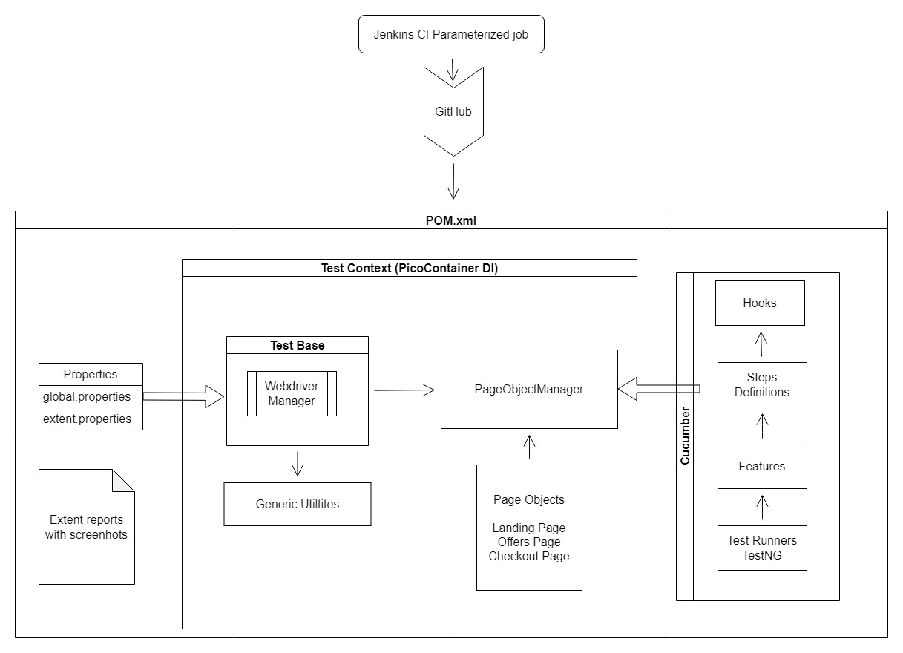
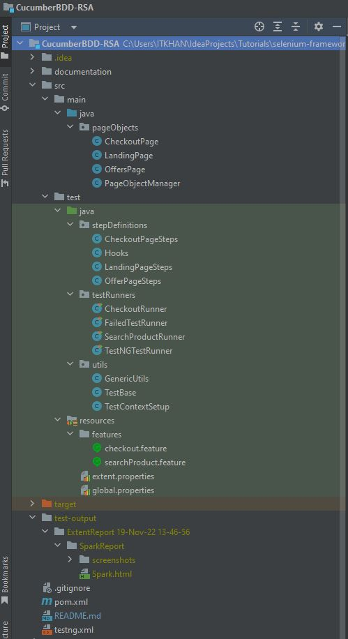

# Cucumber BDD Framework
### BDD, Cucumber, Selenium, Java, TestNG, Maven, Extent reports, Jenkins

### Framework Architecture

### Folder Structure

### Installation Requirements
* JAVA JDK (version 17 used in project)
* Maven
* suitable IDE (IntelliJ used in project)
* Jenkins (only required for remote execution)

### Run Instructions
* Run the tests by right clicking on Runner file and select run as.
* Or install the maven in system and set as system path variable and then run  through command line with `mvn test`
* You can override the Cucumber Options defined in test runners through command line. See [Cucumber Options Docs](https://cucumber.io/docs/cucumber/api/?lang=java#options)
* For example, if you are using Maven and want to run a subset of scenarios tagged with **@PlaceOrder**: `mvn test -D"cucumber.filter.tags=@PlaceOrder"`
* You can also run the feature file  with `mvn test -D"cucumber.features=src/test/resources/features/checkout.feature"`. [Run Cucumber Test from CMD](https://www.toolsqa.com/selenium-cucumber-framework/run-cucumber-test-from-command-line-terminal/)
* Note that options provided by @CucumberOptions take precedence over the properties file and CLI arguments take precedence over all.
* You can also change thr browser at runtime through command line with `mvn test -Dbrowser=firefox` and get this though `System.getProperty("browser");`
* You can also create a parameterized Jenkins Job by adding choice parameters and invoke top-level Maven targets `test -Dcucumber.filter.tags="@"$tags"" -Dbrowser="$browser"`
* 

### Key Concepts covered
* Build `Maven` Project with all the framework dependencies
* Develop `End-to-End` Selenium web scenarios in the feature file
* Implement `TestNG / JUnit runner` to run the framework
* Understand the `Single responsibility` principle to distribute the implementation into multiple step definitions
* Importance of dependency injection to share the data between steps files
* Understand the `Page Object` design pattern to drive locators from the pages
* Implement `Factory desig`n pattern by writing PageObjectManager class to create objects of all PO classes
* Configure and `Distribute the driver` across files in framework
* Run the Cucumber scenarios in Parallel mode using Cucumber TestNG Runner
* Build Test Utilities for `reusable` Selenium methods
* Implement `Cucumber Hooks` to capture Screenshots on test failures
* Implement `Cucumber Tags` to run selected tests in the framework
* Parameterizing the test data to run the Scenarios with multiple data sets
* Creating HTML & `Extent reports` to run the Cucumber Selenium tests
* Running tests in `parallel` mode and generate Extent reports with `Screenshot` attached for the failed scenarios
* Run the Cucumber tests using Maven and Command line options
* Integrate the framework to `CI/CD Jenkins` and schedule the Jobs on regular time interval
* Create `parameterized Jenkins jobs` to dynamically send the global properties at run time of job execution

### Notes
* Check if Cucumber for Java and Gherkin plugins are installed and enabled.
* Folder Structure
  * \src\main\resources is marked as `Test Resources Root`
  * \src\main\resources contains the `feature files`
  * \src\main\java is marked as `Test Sources Root`
  * \src\main\java contain the package `step_definitions`
  * The test runner class should contain the package `step_definitions` as `glue`
* Configure the `maven surefire plugin` and `testng.xml` in pom.xml to run tests with `mvn test`
* Individual steps results are only supported by JUnit test runner and not by TestNG
* [Intellij Cucumber support documentation](https://www.jetbrains.com/help/idea/cucumber-support.html)
* Dependency injection (DI)
  * `Dependency injection (DI)` is one of the design patterns and implementations of the IoC. DI takes the dependent object creation outside of the class and provides required objects in different ways.
  * There are many DI types that you can use, such as Constructor Injection, Property Injection, and Method Injection.
  * In `constructor injection`, the injector provides the required dependency through the constructor. Some third-party tools would help you to implement DI on a constructor. 
  * `Cucumber Picocontainer` is a third-party framework for providing required dependencies in your classes. This framework will make your classes loosely coupled and take all responsibility for injecting required dependencies.
  * you are only responsible for creating constructors and reference names. The rest of the responsibility for providing objects to your class belongs to third-party dependency, Cucumber Picocontainer.
  * After implementation, you are only responsible for creating the constructor and defining what you need in the class. Picocontainer becomes the main responsible for the rest of the assigning and injection.
  * Cucumber scans your classes with step definitions in them, passes them to PicoContainer, then asks it to create new instances for every scenario.
  * Further Reading:
    * [Implementing Dependency Injection with Java-Selenium-Cucumber](https://www.kloia.com/blog/implementing-dependency-injection-with-java-selenium-cucumber)
    * [Dependency injection in Cucumber](https://www.numpyninja.com/post/dependency-injection-in-cucumber)
    * [SHARING STATE BETWEEN CUCUMBER STEPS WITH DEPENDENCY INJECTION](https://angiejones.tech/sharing-state-between-steps-in-cucumber-with-dependency-injection/)
    * [Cucumber Pico-Container Use In Automation](https://medium.com/@jitendra.pisal44/cucumber-pico-container-use-in-automation-79c597d0ef04)
    * [Share WebDriver instance in Cucumber using PicoContainer](https://www.programsbuzz.com/article/share-webdriver-instance-cucumber-using-picocontainer)
    * [Sharing Test Context between Cucumber Step Definitions](https://www.toolsqa.com/selenium-cucumber-framework/sharing-test-context-between-cucumber-step-definitions/)
* Each of the step definitions class should contain the steps for that particular application logic and classes should be loosely coupled.
* Use Factory design pattern to create objects of all the page and utility classes instead of manually instantiating them in steps.
* WebDriverManager() method from TestBase utility will get the selenium webdriver, and pass it to PageObjectManager constructor in the TestContextSetup.
* PageObjectManager will then delegate this driver to all the page objects classes.
* Create Global properties file in src\test\resources because maven looks for properties file in this path.
* Use Cucumber Hooks to perform setUp and tearDown actions
* Webdriver from the TestBase can be accessible through PicoContainer constructor injection, so we have access to all the testBase object.
* To execute any of the step in feature file, Cucumber goes to the steps definition class and execute its constructor first before executing any step. 
* In constructor of the step definition, an instance of the TestContextSetup is being created which will automatically execute the constructor of TestContextSetup.
* In constructor of TextContextSetup, the driver gets initialized when `testBase.WebDriverManager()` is called, therefore we dont need setUp method Hook for driver initialization.
* Put **^** at the start and **$** at the end of step annotation description if your step contains a dynamic input parameter and uses a regular expression.
* Moreover, if your step contains a regular expression paramter, then you have to remove the surrounding commas **""** from the parameters in Examples.
* Define generic Page utilities in PageObjectManager and extend the Page classes from PageObjectManager to use the utilities in both steps definitions and page classes.
* To adapt the cucumber results to extent reports, an external maven plugin is required to be installed `ExtentReports Cucumber7 Adapter`
* To begin using the adapter, add the `com.aventstack.extentreports.cucumber.adapter.ExtentCucumberAdapter` plugin to the runner. From [Extent Report Docs](https://www.extentreports.com/docs/versions/4/java/cucumber4.html)
* Create `extent.properties` file in /src/test/resources and configure the properties for generation of extent reports.
* The report will be generated in /src/test-ouput/ExtentReport d-MMM-YY HH-mm-ss/SparkReport/Spark.html path as configured in extent.properties.
* Attach a screenshot to the failed scenario by adding a new `@AfterStep` Hook, later Extent report will read the screenshot attached to scenario to display it in report.
* To attach the screenshot to scenario, it needs to be converted into Byte format for which we can use **FileUtils** utility from `comms-io` maven plugin.
* Lastly configure the path of screenshot in extent.properties so extent report will look for the screenshots in this path and attach it to report.
* To rerun the failed scenarios, add `rerun:target/failed_scenarios.txt` plugin to the Test Runner which will output the failed scenario in text document.
* Add another test runner and give the path of the failed features as `@target/failed_scenarios.txt`, this will run only the failed scenarios.
* 
