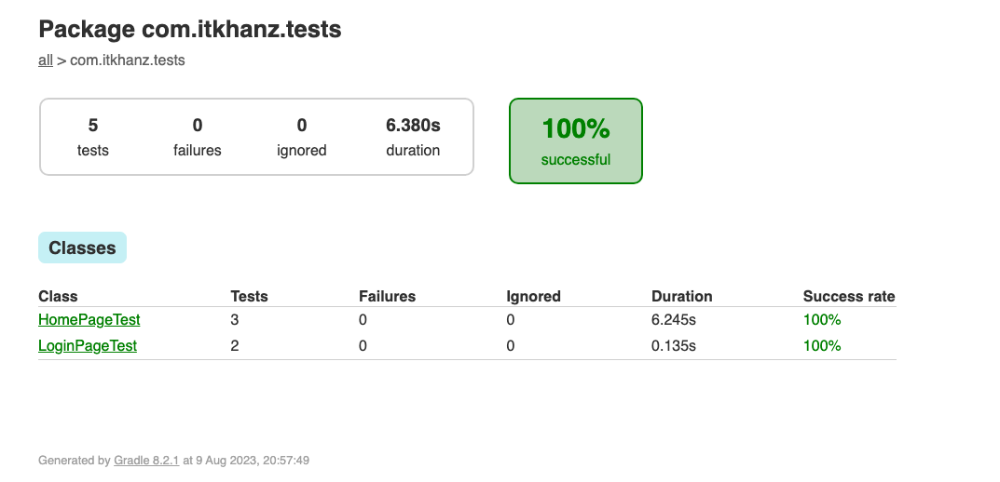
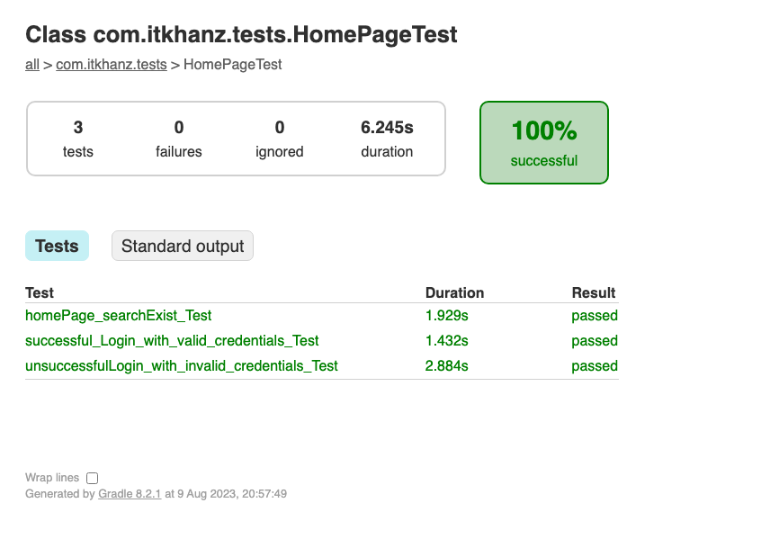
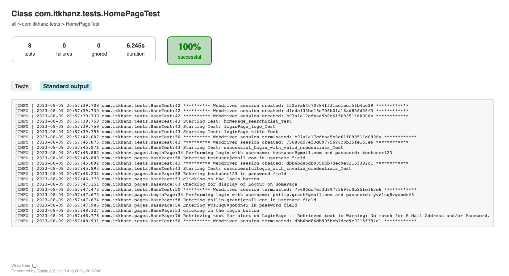

# Selenium TestNG Gradle Framework - Template

* This repo demonstrates the usage of Gradle as build tool for Selenium test automation framework to automate tests for
  open cart demo website.
* This framework allows you to control test execution from commandline, and you can set the browser, test suite,
  thread-count, parallel mode, groups.
* It serves as a basic starting playground template for experimenting with gradle

---

## Libraries

* `Gradle` build tool
* `Selenium Webdriver` browser automation library
* `TestNG` testing framework
* `Log4J2` logging framework
* `Owner` properties management library
* `GSON` for parsing test data in JSON
* `JavaFaker` for generating fake test data

---

## Features

* This framework provides a basic skeleton to run UI automation tests using Selenium Webdriver.
* It makes use of the Page Object Model (POM) design pattern.
* Test Cases are atomic and not dependent on other tests.
* No Hard coding. Test Data and configuration is provided from external files.
* Support for Parallel Execution and driver creation in thread-safe manner.
* Base Url and other test properties must be set in `config.properties`
* User credentials for different test environments are stored in `src/test/resources/test-data/users.json`
* Global framework constants are defined in `GlobalConstants.class`
* Test suites are defined in `src/test/resources/test-suites` directory
* `build.gradle` uses the Groovy as scripting language.

---

## Run Tests

### Pre-requisites

* IntelliJ IDEA as recommended IDE.
* Download and Install following as per your OS and set environment variables:
  * JDK 17 or above
  * Gradle
* Verify installations with:
  * `java --version`
  * `gradle -v`
* Clone the repo, navigate to project root and
  * run `gradlew build` on mac or linux
  * run `gradlew.bat build` on windows
  * This will compile and build the application inside `build`folder.
* `gradlew clean` will remove the `build` folder
* 

### Test Commands

* To run tests sequentially:
  * `gradle clean test` will execute the tests from default suite testng.xml
* To run cross-browser tests:
  * In Parallel with 2 threads ` gradle clean test -DsuiteName=cross-browser -Dparallel=tests -DthreadCount=2`
* To run tests on specific browser:
  * In Parallel Classes using 2 threads on firefox `gradle clean test -Dbrowser=firefox -DsuiteName=single-browser -Dparallel=classes -DthreadCount=2`
  * In Parallel Methods using 4 threads on chrome `gradle clean test -Dbrowser=chrome -DsuiteName=single-browser -Dparallel=methods -DthreadCount=4`
  * In Sequential on chrome browser `gradle clean test -Dbrowser=chrome -DsuiteName=single-browser -Dparallel=false`
* To run single test class or method, we can use gradle test filter option. This allows filtering tests for execution
  using `--tests`. Using `--tests` option, we can also limit testing to a single method within the test class. This helps
  you to run a single method/class at a time:
  * To run single test class: `gradle clean test -Dbrowser=chrome -DsuiteName=single-browser --tests com.itkhanz.tests.LoginPageTest`
  * To run single test method: ` gradle clean test -Dbrowser=chrome -DsuiteName=single-browser --tests com.itkhanz.tests.LoginPageTest.loginPage_logo_Test`
* To run group of tests, you can pass the groups to include from commandline:
  * To run only smoke tests, run `gradle clean test -Dbrowser=chrome -DsuiteName=single-browser -Dgroups=smoke`

### Test Output

* Gradle output in commandline also prints the test results summary to console.
* Test Reports are generated:
  * TestNG reports under `test-output` directory
  * Gradle reports under `gradle-reports` directory
* Logs are written under `logs` directory inside browser specific folders.
* Below is how the gradle report looks like:

--

## TODOS

* Route Console logs for log4j to browser specific route in cross browser parallel execution
* Add Custom Exceptions. annotations, model
* Capture screenshots
* Use fluent assertions with AssertJ
* Add test-reporting e.g. Allure
* Add CI workflow e.g. Jenkins or GitHub Actions
* Refer to [selenium-java-lean-test-architecture](https://github.com/eliasnogueira/selenium-java-lean-test-architecture)
  from `Elias Nogueira` to see more advanced usage and expand upon existing functionalities.
* 

## Resources

* [Building Java & JVM projects]()https://docs.gradle.org/current/userguide/building_java_projects.html
* [Testing in Java & JVM projects](https://docs.gradle.org/current/userguide/java_testing.html#java_testing)
* [Executing Gradle builds on Jenkins](https://docs.gradle.org/current/userguide/jenkins.html)
* [Executing Gradle builds on GitHub Actions](https://docs.gradle.org/current/userguide/github-actions.html)
* [TestNG - Gradle example](https://www.seleniumeasy.com/testng-tutorials/using-testng-with-gradle)
* [Example Selenium TestNG build.gradle](https://github.com/sysgears/selenium-automation-bundle/blob/master/build.gradle)
